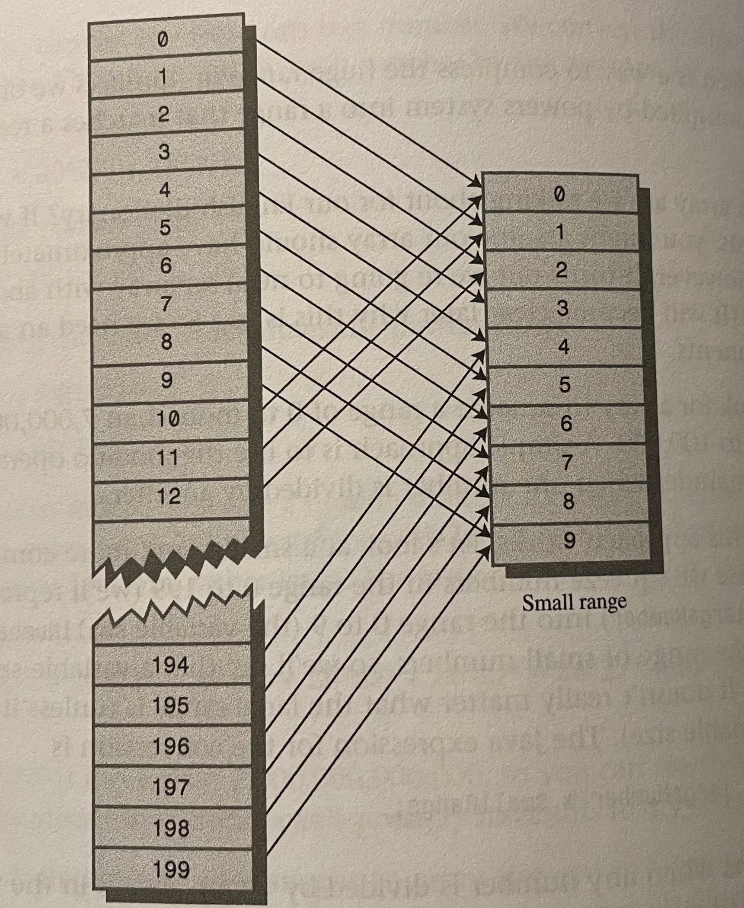
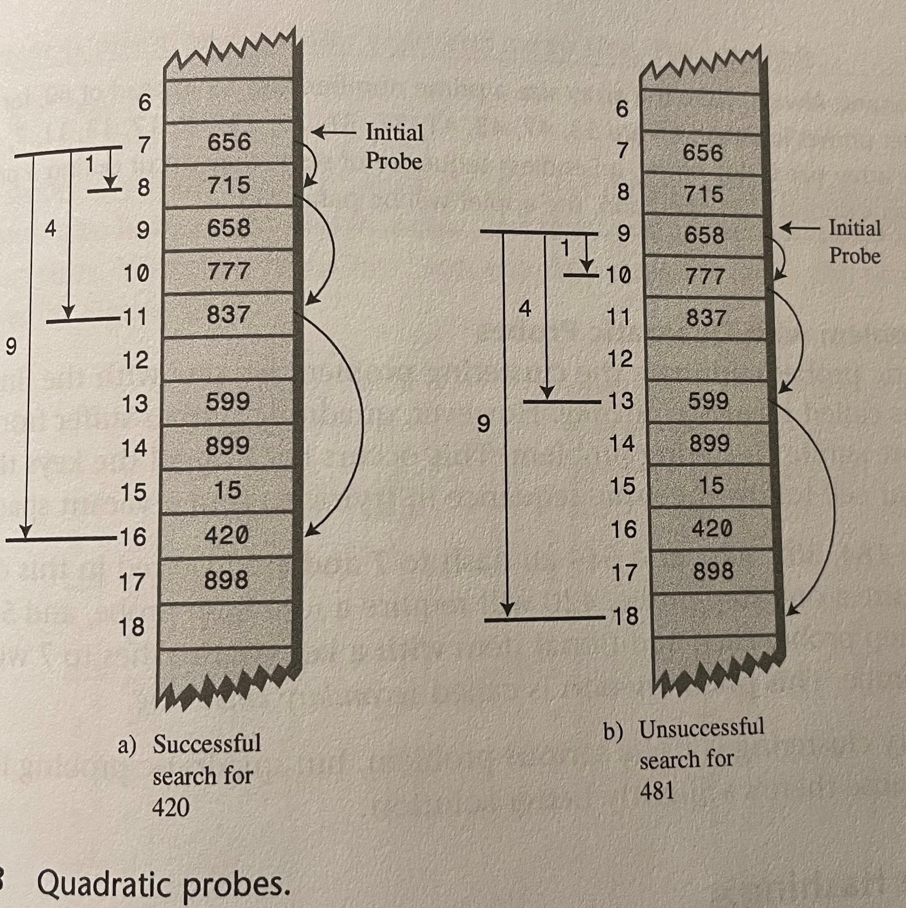
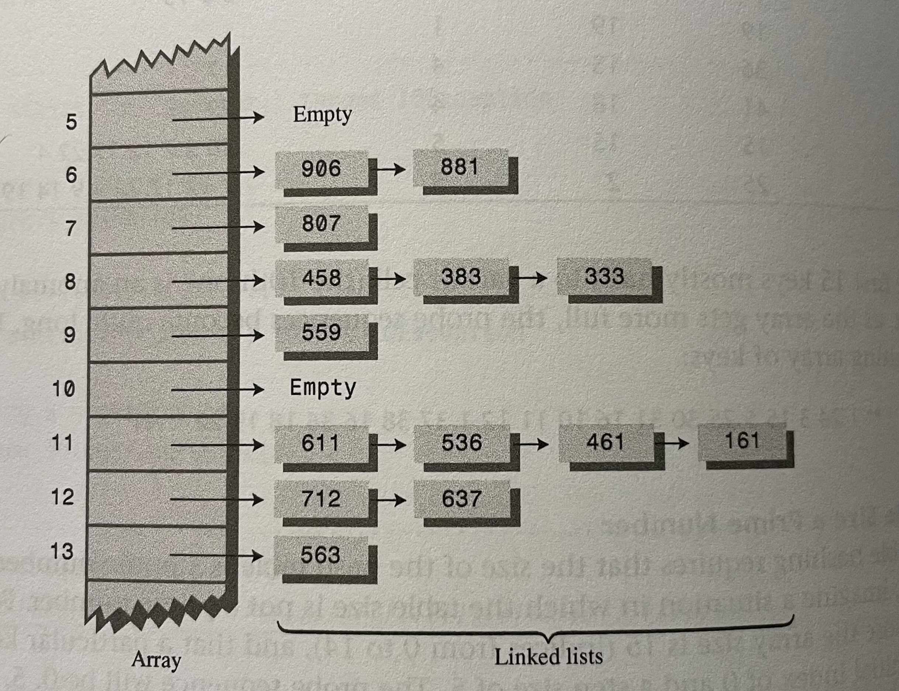

# Hash Tables

Keys are hashed to array indexes. Very fast inserting and searching, insertion and searching (and sometimes deletion) can take close to constant time O(1).
Programs typically use Hash Tables when they need to look up tens of thousands of items in less than a second. Disadvantages
include difficulty to expand, degraded performance if too full (**load factor**), no convenient way to visit items in any order. Best practice is to double the size of your underlying array.

An important concept of Hash Tables is **how a range of key values are transformed into a range of array index values**. (Hashing)

## Hashing

A *hash function* converts a number in a large range into a number in a smaller range. This smaller range corresponds to the index numbers in an array. **A common approach to squeeze a large range into a smaller one is to use the modulo % operator.** When numbers are divided, the remainder will fall in the range from 0 to that dividend.

**Example:** `13 % 10 = 3 , 157 % 10 = 7`

This allows us to squeeze a big range into a smaller manageable range.

**Hash Function Ex**: `arrayIndex = hugeNumber % arraySize`

<!--  -->

### Hash Function Best Practices

- Quick Computation
- Don't Use Non-Data
- Use All Relevant Data
- Use Prime Number for Modulo Base

### Collisions

Condensing the large range into a small one creates a problem in the form of collisions. This is when two keys hash to the same array index, there are two ways to deal with this: **Open Addressing** & **Separate Chaining**.

### Open Addressing

When a data item can't be placed at the hashed index, we will try to put the item into an open cell. There are 3 searching methods that can be used to find an open location: **Linear Probing, Quadratic Probing, and Double Hashing**.

Linear Probing: We search sequentially for the next open position and place the data item there. **Not used often because creates primary clustering problem when the load factor becomes large, which degrades performance of the hash table**. (*Load factor is the amount of items in array divided by the array size (n / arraySize)*)

Quadratic Probing: An attempt to keep clusters from forming. Quadratic probing spreads out in wider search area for a new cell location if a collision occurs. The **Step is the Square of the Step Number**, the distance from the initial probe is the square of the step number: `x+1^2, x+2^2, x+3^2, x+4^2, x+5^2` and so on. **Does create a less serious clustering problem called Secondary Clustering**

<!--  -->

**Double Hashing**: This is considered the best method for Open Addressing. This method generates probe sequences that depend on the key, which will allow different keys to have different step numbers. **This means numbers with different keys that hash to the same index will use different probe sequences**. **Hash Table must be prime number if using double hashing**. Secondary Hash Functions must have these characteristics:

- Must not be the same as the primary hash function.
- Must never output 0.

Example Secondary Hash Function: `stepSize = constant - (key % constant)`

### Separate Chaining

Implements a linked list at each array index, we will just prepend or append the data item to the linked list. No need to worry about collisions in this case, just need to make a linked list class.

<!--  -->